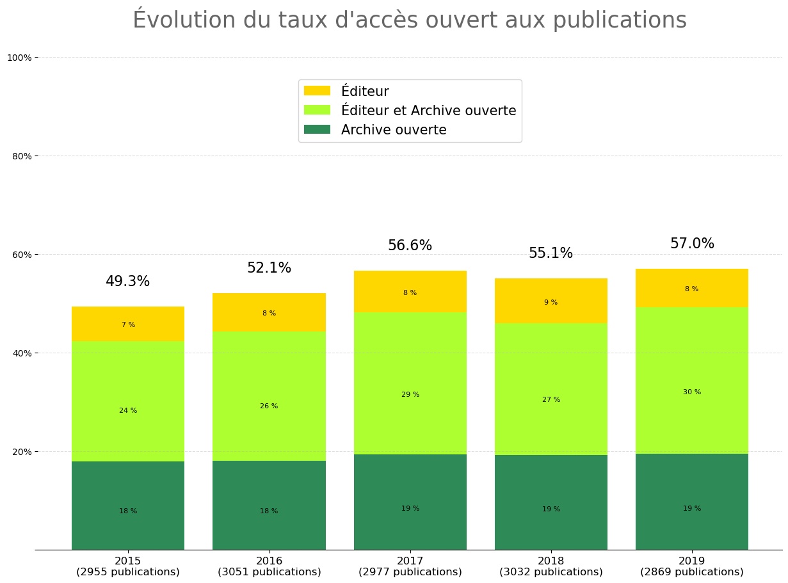

# Baromètre de la science ouverte de l'UVSQ

  
  

<!--repris et adaptaté

  
### Table des matières
* [Intégrer les publications de HAL sans DOI](#intégrer-les-publications-de-HAL-sans-DOI)  
* [Pister les APC](#pister-les-APC)  
* [Schéma de données](#Schéma-de-données)  

### Présentation -->
le Baromètre de la science ouverte de l'UVSQ reprend celui de l'université de Lorraine (mars 2020), dont le code a été [partagé sur gitlab]( https://gitlab.com/Cthulhus_Queen/barometre_scienceouverte_universitedelorraine/-/blob/master/barometre_universite_lorraine.ipynb). Deux modifications ont été apportées : la première permet d'intégrer les publications venant de HAL ne possédant pas de DOI,  la seconde apporte des informations sur les frais de publication (Article Processing Charges : APC).

### Intégrer les publications de HAL sans DOI
Afin de minimiser les lacunes les publications sans DOI venant de HAL ont été intégrées. Cette quantité de publication supplémentaire modifie évidemment les résultats d'accès ouvert, et impact aussi la méthodogie à plusieurs étapes : dédoublonnage, détection de l'accès ouvert et alignement des rétérentiels.

**Résultats**

L'intégration des publications de HAL sans DOI *baisse* le pourcentage de publication en accès ouvert. Voici la Comparaison pour l'UVSQ

|année|doi seuls|doi ou halId|
|:-----:|:------:|:---------:|
|2015 |54.8 %|49.3%|
|2016|56.3%|52.1%|
|2017|60.2%|56.6%|
|2018|58.6%|55.1%|
|2019|58.6%|57.0%|

**Dédoublonnage**

Les publications sans DOI ont été dédoublonnées à partir d'une normalisation des titres : retrait des espaces, accents et mise en minuscule. Les publications de HAL sans DOI ayant un titre identique à une autre ont été retirées.

Cette étape permet également d'identifier des publications HAL où le DOI pourrait être manquant (voir les tableaux HAL dans `/data/out/`).

**Détection de l'accès ouvert**

Une publication dans HAL est en accès ouvert si au moins une des conditions suivante est remplie
- la métadonnée `submitType_s` contient `file`
- la métadonnée `linkExtId_s` contient `arxiv` ou `pubmemdcentral`

**Alignement des référentiels**

Deux dictionnaires ont été réalisés afin d'aligner (i) les types de document de HAL avec ceux de Crossref et (ii)les domaines scientifiques de HAL avec ceux du baromètre français de la science ouverte.
Voir `/data/match_referentials.json`
 

### Pister les APC
Le but est d'obtenir des informations sur d'éventuels APC (Article Processing Charges) afin d'alimenter [openapc](https://github.com/OpenAPC/).   En considérant au moins les "accords transformants" (publish & read) ; les changements possibles de modèle économique des revues, et enfin les éventuelles éxonérations (*waivers*) il reste difficle de savoir si des APCs ont été payés et a fortiori de connaitre le montant payé. Les informations sont donc données à titre indicatif.

L'algorithme réalisé se compose de quatre étapes : 

+ Le DOI est-il dans [openapc](https://github.com/OpenAPC/openapc-de) ? 
    + oui, renseigner `doi_in_openapc` et extraire le montant payé
	+ non, la revue est-elle dans openapc et des frais de publications ont-ils été payés _la même année_ ?
	
	    + oui, renseigner `journal_in_openapc`  et extraire la moyenne des montants payés sur l'année
		
		+ non, le document est-il en open access sur le site de l'éditeur dans une revue hybride ? (utilisation du champs `oa_status` de unpaywall)
			+ oui, renseigner `journal_is_hybrid`
			+ non, la revue est-elle une revue avec APC indéxée dans le [DOAJ](https://doaj.org/) ?
				+ oui, retourner `apc_journals_in_doaj` , le prix et la devise
 

### Reproduire ce baromètre pour son établissement

0. Installer Python et les libraries signalées dans le fichier `requirement.txt`
1. Télécharger l'archive au format .zip
2. Ajouter les fichiers bibliographiques de votre établissement
3. Renommer si nécessaire les noms des fichiers importés dans le code `a_consolider_sources.py`
4. Exécutez les codes `a_consolider_sources.py` puis `b_enrichir_data.py` et `c_produire_graphique.py`
5. Retrouvez les graphiques générés sont dans le dossier `img` 

### Schéma de données

| column             | description (if needed)                                                                       | source                   |
|--------------------|-----------------------------------------------------------------------------------------------|--------------------------|
| doi                |                                                                                               |                          |
| halId              | Publication deposit id in HAL                                                                 | hal                      |
| hal_coverage       | Hal coverage (in or missing )                                                                 | hal                      |
| title              |                                                                                               | hal or unpaywall         |
| genre              | Document type                                                                                 | hal or unpaywall         |
| author_count       | Curiosity : number of authors                                                                 | hal or unpaywall         |
| published_date     |                                                                                               | hal or unpaywall         |
| published_year     |                                                                                               | hal or unpaywall         |
| journal_name       |                                                                                               | hal or unpaywall         |
| journal_issns      |                                                                                               | hal or unpaywall         |
| publisher          |                                                                                               | hal or unpaywall         |
| upw_coverage       | Unpaywall coverage (oa, missing, closed)                                                      | unpaywall                |
| oa_status          | Status/type of open access (green, gold, hybrid, bronze)                                      | unpaywall                |
| upw_location       | Where OA is founded (repository and/or publisher)                                             | unpaywall                |
| version            | Publication version available (submitted, accepted, published)                                | unpaywall                |
| suspicious_journal | Is the journal in "predatory" list                                                            | [Stop Predatory Journals](https://github.com/stop-predatory-journals/stop-predatory-journals.github.io)|
| hal_submittedDate  | When the publication has been submitted in HAL                                                | hal                      |
| hal_location       | Where OA is founded (file, arxiv, pubmedcentral)                                              | hal                      |
| hal_licence        | Licence in HAL deposit                                                                        | hal                      |
| hal_serlArchiving  | Curiosity : is the deposit made by the author                                                 | hal                      |
| hal_docType        | Type of document                                                                              | hal                      |
| hal_domain         | Domain, scientific field from hal                                                             | hal                      |
| licence            | licence finded in unpaywall                                                                   | unpaywall                |
| apc_tracking       | APC information (doi_in_openapc, journal_in_openapc, journal_is_hybrid, apc_journals_in_doaj) | openapc, doaj, unpaywall |
| journal_is_in_doaj | Is this resource published in a DOAJ-indexed journal                                          | unpaywall                |
| journal_is_oa      | Is this resource published in a completely OA journal                                         | unpaywall                |
| is_paratext        | Is the item an ancillary part of a journal (column disappear if everything is False )         | unpaywall                |
| apc_amount         | Rough approximation of APC cost                                                               | openapc, doaj            |
| apc_currency       |                                                                                               | openapc, doaj            |
| scientific_field   | Scientific field from barometre-science-ouverte and hal                                       | barometre-so, hal        |
| is_oa              | Is there an OA copy of this ressource                                                         | hal, unpaywall           |
| oa_type            | Publisher and/repository                                                                      | hal, unpaywall           |

### Voir aussi
  * le baromètre français de la science ouverte https://ministeresuprecherche.github.io/bso/

### Remerciements

Eric Jeangirard, Laetitia Bracco et les équipes et communautés derrière Unpaywall, DOAJ et OpenAPC.